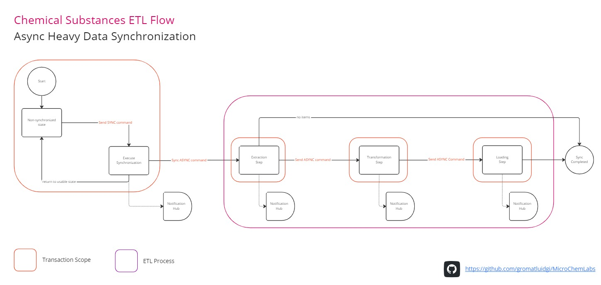
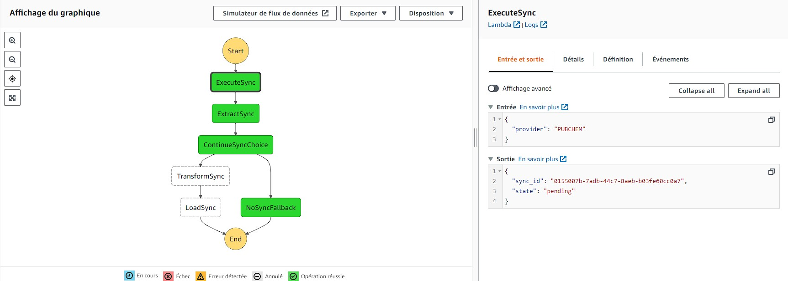
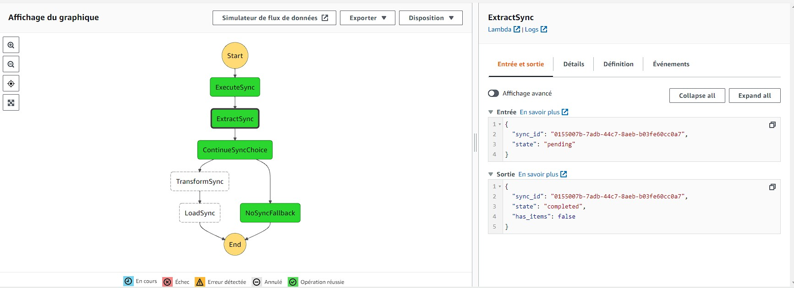
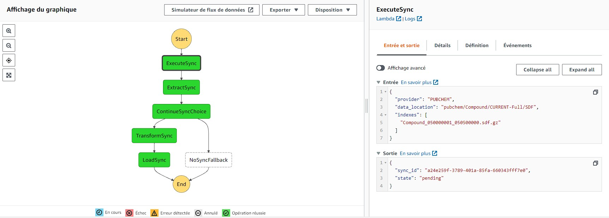
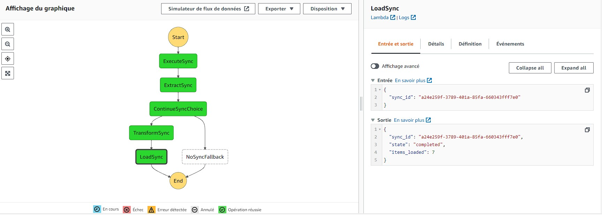
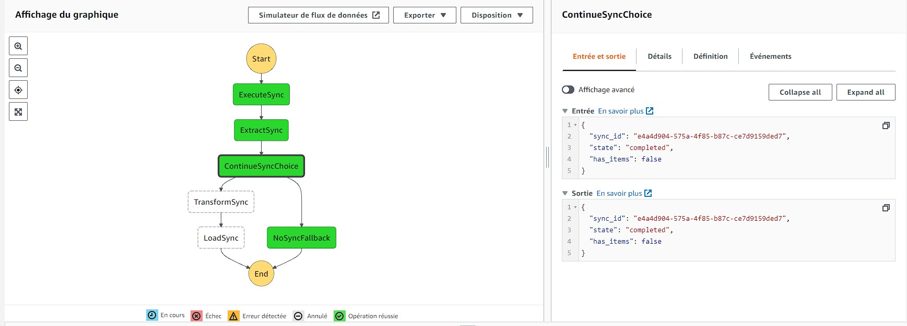

# MicroChemLabs

Playground project used as a support for design a **Chemical Domain Microservice** for self-managed and serverless infrastructure; following **Domain Driven Design** principles.

## Packages

### Stubs
`/.stubs`

Typehinting for libraries relied on C/C++. Custom stubs are generated with mypy.

### Shared Kernel
`/packages/shared-kernel`

This package provides building blocks used to implements **DDD** and **Event Driven** concepts/patterns.

[Show package](./packages/shared-kernel/)

### Science Kernel
`/packages/science-kernel`

This package provides utilities used to manipulate **molecules** and performs **chemical/physical computations**.

[Show package](./packages/science-kernel/)

### Substances Service
`/packages/substances-service`

Datawarehouse for any kinds of chemical substance.

[Show project](./packages/substances-service/)

#### Features

- Extract, transform, load and standardize* chemical substances issued by various provider *(Pubchem, Chebi...)* in many forms *(SDF, Smiles...)*.
- Import substances from **SMILES** issued in many data type *(TEXT, FILE, RAW BINARY)*
- Query Synchronization read models with GraphQL.
- Query Substance read models with GraphQL.

##### ETL Flow

##### Serverless ETL - Without location (Automatic)

##### Serverless ETL - Specific location and indexes

##### Serverless ETL - No items available

## Stack

**Languages**
- Python
- Typescript

**Frameworks and Technologies**
- Docker
- Python 3.9 (max runtime version supported by AWS)
- Poetry
- Node.js
- React
- Postgresql
- RabbitMQ
- GraphQL
- gRPC
- Apollo Server

**Cloud**
- Serverless Framework
- AWS CloudFormation
- AWS API Gateway
- AWS AppSync (GraphQL)
- AWS CloudFront
- AWS S3
- AWS Lambda
- AWS EFS (Elastic File System)
- Amazon VPC (Virtual Private Cloud)
- AWS DynamoDB
- AWS EventBridge
- AWS SQS (Simple Queue Service)
- AWS SNS (Simple Notification Service)
- AWS Step Functions
- AWS Cognito (Authentication)
- AWS Amplify
- AWS Faregat*

## Publications related to the studied domain

### Cheminformatics

- [Chemputation and the Standardization of Chemical Informatics](/docs/publications/cheminformatics/Chemputation%20and%20the%20Standardization%20of%20Chemical%20Informatics.pdf) - Alexander J. S. Hammer, Artem I. Leonov, Nicola L. Bell, and Leroy Cronin
- [RetroRules: a database of reaction rules for engineering biology](/docs/publications/cheminformatics/RetroRules%20a%20database%20of%20reaction%20rules%20for.pdf) - Thomas Duigou, Melchior du Lac, Pablo Carbonel and Jean-Loup Faulon
- [AutoLabDB: a substantial open source database schema to support a high-throughput automated laboratory](/docs/publications/cheminformatics/AutoLabDB%20a%20substantial%20open%20source%20database%20schema%20to.pdf)
- [Making the collective knowledge of chemistry open and machine actionable](/docs/publications/cheminformatics/Making%20the%20collective%20knowledge%20of%20chemistry.pdf)
- [An open source chemical structure curation pipeline using RDKit](/docs/publications/cheminformatics/An%20open%20source%20chemical%20structure%20curation%20pipeline%20using%20RDKit.pdf).

### Classification

- [Analysing names of organic chemical compounds – From morpho–semantics to SMILES strings and classes](/docs/publications/classification/Analysing%20names%20of%20organic%20chemical%20compounds%20–%20From%20morpho–semantics%20to%20SMILES%20strings%20and%20classes.pdf)
- [Current challenges in development of a database of three-dimensional chemical structures](/docs/publications/cheminformatics/Current%20challenges%20in%20development%20of%20a%20database%20of%20three-dimensional%20chemical%20structures.pdf)

#### Ontologies

- [Predicting Chemical Reaction Outcomes: A Grammar Ontology-based Transformer Framework](/docs/publications/classification/predicting-chemical-reaction-outcomes-a-grammar-ontology-based-transformer-framework.pdf)
- [Ontologies4Chem: the landscape of ontologies in chemistry](/docs/publications/classification/Ontologies4Chem%20the%20landscape%20of%20ontologies%20in%20chemistry.pdf)
- [OntoMongo - Ontology-Based Data Access for NoSQL](/docs/publications/classification/OntoMongo%20-%20Ontology-Based%20Data%20Access%20for%20NoSQL.pdf)
- [M2Onto: an Approach and a Tool to Learn OWL Ontology from MongoDB Database](/docs/publications/classification/M2Onto-%20an%20Approach%20and%20a%20Tool%20to%20Learn%20OWL%20Ontology%20from%20MongoDB%20Database.pdf)

#### Taxonomy

- [Data-driven Approach to Equipment Taxonomy Classification](/docs/publications/classification/Data-driven%20Approach%20to%20Equipment%20Taxonomy%20Classification.pdf) - Sarah Lukens
- [ClassyFire: automated chemical classification with a comprehensive, computable taxonomy](/docs/publications/classification/ClassyFire%20automated%20chemical.pdf)

## Libraries & Frameworks

### Science

#### Open Babel

- [Wiki](http://openbabel.org/wiki/Main_Page)

#### RDKit

- [Getting Started with the RDKit in Python](https://www.rdkit.org/docs/GettingStartedInPython.html)
- [RDKit Book](https://github.com/rdkit/rdkit/blob/master/Docs/Book/RDKit_Book.rst)
- [Read SDF with amino acids specified as pseudo atoms](https://www.cheminformania.com/learn-how-to-hack-rdkit-to-handle-peptides-with-pseudo-atoms/)
- [How to convert SMILES to Amino Acids sequence using RDKit](https://github.com/rdkit/rdkit/discussions/4659)

#### CDK (Chemistry Development Kit)

- [CDK Book](https://egonw.github.io/cdkbook/)
- [API Docs](http://cdk.github.io/cdk/latest/docs/api/index.html?overview-summary.html)

#### Others

- [OPSIN - Open Parser for Systematic IUPAC Nomenclature](https://github.com/dan2097/opsin)
- [chemfp - Fast cheminformatics fingerprint search, anywhere you use Python](https://chemfp.com)

### Ressources

- [Allotrope](https://www.allotrope.org/)
- [EMBL-EBI Ontology Lookup Service](https://www.ebi.ac.uk/ols/index)

## Tools

- [Protege](https://protege.stanford.edu/): A free, open-source ontology editor and framework for building intelligent systems
- [DBeaver](https://dbeaver.io/): Free multi-platform database tool for developers, database administrators, analysts and all people who need to work with databases.
- [Postman](https://www.postman.com/): Postman is an API platform for building and using APIs. Postman simplifies each step of the API lifecycle and streamlines collaboration so you can create better APIs—faster.
- [Serverless Framework](https://www.serverless.com/): All-in-one development solution for auto-scaling apps on AWS Lambda

### Python

- [GRPC Tools](https://grpc.io/docs/languages/python/quickstart/): Python’s gRPC tools include the protocol buffer compiler protoc and the special plugin for generating server and client code from .proto service definitions.

## Linting

### Python

- [Bandit](https://bandit.readthedocs.io/en/latest/)
- [mypy](https://mypy.readthedocs.io/en/stable/)
- [pytest](https://docs.pytest.org/en/7.2.x/)
- [pylint](https://www.pylint.org/)
- [isort](https://github.com/PyCQA/isort)
- [black](https://black.readthedocs.io/en/stable/)
- [flake8](https://flake8.pycqa.org/en/latest/)
