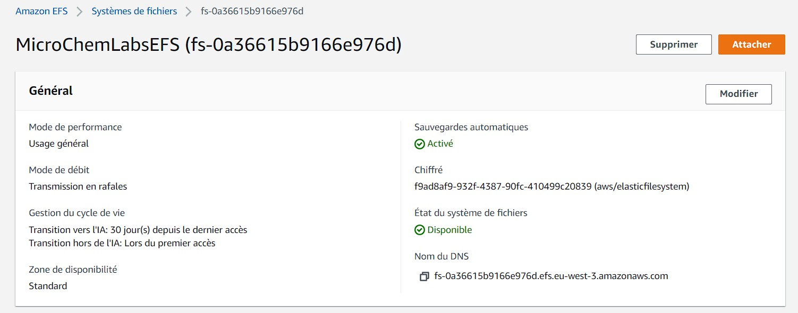

# Substances Microservice - AWS Serverless Implementation

## Configure EFS (Elastic File System)




## Configure EC2 Instance

### Amazon Linux 2

- Must allow Inbound rule on port 2049 (NFS)
- Ensure EC2 instance and EFS have the same:
  - VPC
  - Security Group
- The Virtual Private Cloud MUST have a VPC Endpoint which got access to DynamoDB

#### Install Python 3.9.13

1. Connect to EC2 instance via SSH with keypair.
2. Run
```
sudo yum -y groupinstall "Development Tools"
sudo yum -y install gcc openssl-devel bzip2-devel libffi-devel
cd /home/ec2-user
wget https://www.python.org/ftp/python/3.9.13/Python-3.9.13.tgz
tar zxvf Python-3.9.13.tgz
cd Python-3.9.13/
./configure
make
sudo make altinstall
python3.9 --version
```

#### Install libX* dependencies

```
sudo yum -y install libXrender libXext libXtst
```

#### Install NFS

```
sudo yum -y update
sudo yum -y nfs-common
sudo yum -y install nfs-utils
```

#### Mount EFS

```
mkdir ~/efs-mount-point
sudo mount -t nfs -o nfsvers=4.1,rsize=1048576,wsize=1048576,hard,timeo=600,retrans=2,noresvport fs-0a36615b9166e976d.efs.eu-west-3.amazonaws.com:/ ~/efs-mount-point
```

#### Install shared dependencies

```
cd ~/efs-mount-point
python3.9 -m pip install --upgrade --target mnt/efs rdkit pandas
```

`cp -a /usr/lib64/. ~/efs-mount-point/mnt/efs/lib/`

or

`rsync -a /usr/lib64/. ~/efs-mount-point/mnt/efs/lib/`

Add `/mnt/efs/lib` path to LD_LIBRARY_PATH Lambda environment variable

Ex: `/lib64:/usr/lib64:$LAMBDA_RUNTIME_DIR:$LAMBDA_RUNTIME_DIR/lib:$LAMBDA_TASK_ROOT:$LAMBDA_TASK_ROOT/lib:/opt/lib:/mnt/efs/lib`

## Step Functions


## GraphQL with AWS AppSync

- [AppSync Client Documentation](https://awscli.amazonaws.com/v2/documentation/api/latest/reference/appsync/index.html#cli-aws-appsync)
- [Cli Parameters from file](https://docs.aws.amazon.com/cli/latest/userguide/cli-usage-parameters-file.html)


### Instructions

- aws appsync create-graphql-api --name substances-service-graphql-dev --authentication-type API_KEY

#### Syncs

- aws appsync start-schema-creation --api-id wtu42km4kvdj3fpvimf6ndrpda --definition fileb://api/src/graphql/sync.graphql
  - aws appsync get-schema-creation-status --api-id wtu42km4kvdj3fpvimf6ndrpda
- aws appsync create-data-source --api-id wtu42km4kvdj3fpvimf6ndrpda --name DynamoSyncs --type AMAZON_DYNAMODB --service-role-arn arn:aws:iam::827916216174:role/substances-service-dev-role --dynamodb-config tableName=substances-service-syncs-dev,awsRegion=eu-west-3

##### Query Resolvers

- aws appsync create-resolver --api-id wtu42km4kvdj3fpvimf6ndrpda --type-name Query --field-name getSync --data-source-name DynamoSyncs --request-mapping-template file://api/src/graphql/sync.request.mapping.json --response-mapping-template file://api/src/graphql/sync.response.mapping.json

##### Mutation Resolvers

## Integration tests with Serverless Framework

Documentation: https://www.serverless.com/framework/docs/providers/aws/cli-reference/invoke-local

### Plugins

- serverless-step-functions

### Commands

#### Import susbtance from string

1. Go the application directory `cd api`
2. Run test with Serverless Framework
`serverless invoke local --function ImportSubstance --data '{\"format\":\"SMILES\", \"data\":\"CC(=O)OC1=CC=CC=C1C(=O)O\"}'`

#### Execute substances synchronization

1. Go the application directory `cd api`
2. Run test with Serverless Framework
`serverless invoke local --function executeSync --data '{\"provider\":\"PUBCHEM\"}'`

